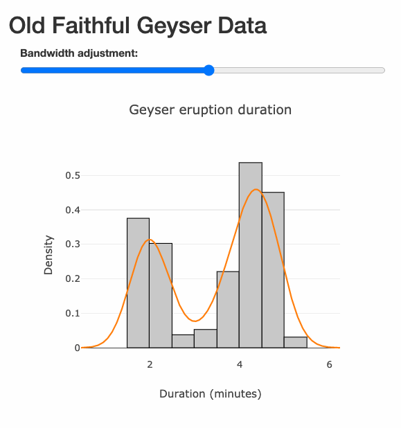
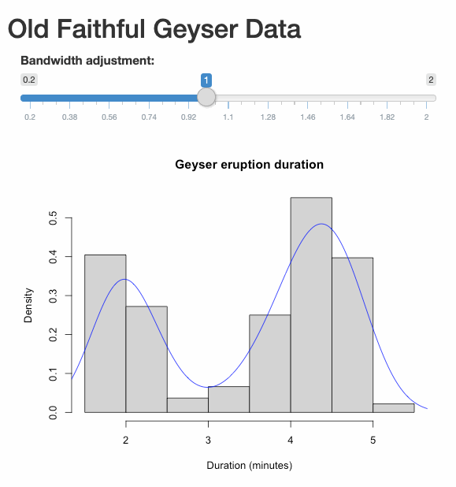

Usage with R markdown and shiny
===============================

### 1. Embed a sketch R file in R Markdown document

Suppose the sketch R file is `sketch.R`, then it can be embedded in an
RMD file using `sketch::insert_sketch` in a code chunk:

    sketch::insert_sketch(file = "sketch.R", width = 800, height = 600)

<iframe src="./figures/circle_packing_logo.html" style="width:530px; height:220px; border:0;">
</iframe>

------------------------------------------------------------------------

### 2. Using sketch code in shiny

Use `compile_r` to turn a sketch R file into a JavaScript file, copy it
into the `www` folder of the shiny App, then include the script tag
`tags$script(src = ...)` in the shiny UI.

#### 2.1. A full example

Here is an example of shiny App with and without sketch code.

The advantage of using sketch is that it gives you complete control of
the JavaScript behaviour, but the disadvantage is of course that more
work is needed to achieve such control.

#### 2.2. Source code

##### app.R

    library(shiny)

    # Define UI for application that draws a histogram
    ui <- fluidPage(
        tags$head(tags$script(src="https://cdn.plot.ly/plotly-latest.min.js")),
        titlePanel("Old Faithful Geyser Data"),
        mainPanel(
            tags$script(src="dom.js"),
            tags$script(src="slider.js"),
            tags$script(src="plot.js"),
        )
    )

    # Define server logic required to draw a histogram
    server <- function(input, output, session) {
        # Send data for plotting the histogram at the start
        session$sendCustomMessage(
            "hist_data",  
            list(x = faithful$eruptions, probability = TRUE,
                 xlab = "Duration (minutes)",
                 main = "Geyser eruption duration")
        )
        
        # When a slider value is received, send the density values over
        observeEvent(input$slider_value, {
            cat("\nMessage received\n")
            print(input$slider_value)
            bw_adjust <- as.numeric(input$slider_value$data)
            dens <- density(faithful$eruptions, adjust = bw_adjust)
            session$sendCustomMessage("den_data", dens)
        })
    }

    # Run the application 
    shinyApp(ui = ui, server = server)

##### dom.js

`dom.js` is provided by the package, and the file path can be found
using `src("dom")`. Suppose you are at the shiny App directory, in which
there is an `www` folder, then `dom.js` can be generated by running
`file.copy(src("dom"), output = "./www/dom.js")`.

##### slider.R

    # Create a bare bone slider
    container <- dom("div", list(id = "slider_1"))
    label <- dom("label", list(innerText = "Bandwidth adjustment:"))
    slider <- dom("input", list(type = "range", min = 0.2, max = 2, 
                                value = 1, step = 0.01, style = "width: 480px"))

    # Send commands to R when the slider changes
    slider$oninput <- function() {
        # Use method provided by the Shiny object
        Shiny$onInputChange("slider_value", list(bw_adjust = self$value))
    }

    print_dom(container, ".col-sm-8")
    print_dom(label, "#slider_1")
    print_dom(slider, "#slider_1")

Generate `slider.js` using the following command:

    compile_r(
      input = "slider.R", output = "./www/slider.js", 
      rules = basic_rules(),  deparsers = basic_deparsers()
    )

##### plot.R

    hist_container <- dom("div", list(id = "myDiv", style = "width: 500px"))
    print_dom(hist_container, ".col-sm-8")

    # Histogram plot
    hist <- function(msg, at = "myDiv") {
        declare (data, layout)
        data <- list(x = msg$x, type = "histogram", 
                     histnorm = ifelse(msg$probability, "probability density", "count"),
                     marker = list(color = "rgb(200, 200, 200)",
                                   line = list(color = "rgb(0, 0, 0)", width = 1)))
        layout <- list(title = msg$main, 
                       xaxis = list(title = msg$xlab),
                       yaxis = list(title = ifelse(msg$probability, "Density", "Frequency")),
                       showlegend = FALSE)
        Plotly::newPlot(at, Array(data), layout)
    }
    Shiny$addCustomMessageHandler("hist_data", hist)

    # Density plot
    trace_exists <- FALSE
    density <- function(msg, at = "myDiv") {
        declare (data)
        data <- list(x = msg$x, y = msg$y, type = "scatter", showlegend =  FALSE)
        if (!trace_exists) {    # Add trace if not existed
            Plotly::addTraces(at, data)
            trace_exists <- TRUE
        } else {                # Update trace if existed
            Plotly::deleteTraces(at, -1)
            Plotly::addTraces(at, data)
        }
    }
    Shiny$addCustomMessageHandler("den_data", density)

Generate `plot.js` using the following command:

    compile_r(
      input = "plot.R", output = "./www/plot.js", 
      rules = basic_rules(),  deparsers = basic_deparsers()
    )
